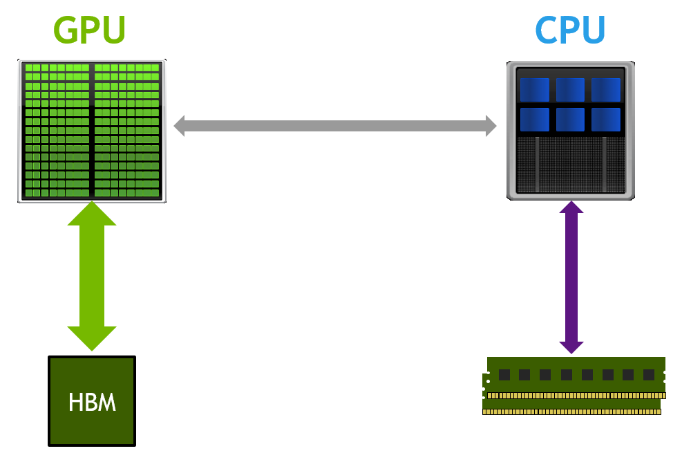

# Speculative Decoding 

# Why this works?
Most of the work getting done is **NOT** about compputation, but its actually about all those read/writes to memory access.
Bc whats happening is that the input lives on the memory and when you do any computation, it has to travel to the GPU/ to all the caches and registers to do the computation and then back to the memory. This is a very slow process. 

So each time we are doing round trips which is slow and very expensive. SO the idea is basically we gonna do a single trip to GPU and while that memory or at least a chunk of it is in the GPU, we are gonna do as much computation as possible and then we gonna load back the results to the memory.

Now the clever idea is to use a small and cheap draft model to first generate a candidate sequence of K tokens - a "draft". Then we feed all of these together through the big model in a batch. This is almost as fast as feeding in just one token, per the above. Then we go from left to right over the logits predicted by the model and sample tokens. Any sample that agrees with the draft allows us to immediately skip forward to the next token. If there is a disagreement then we throw the draft away and eat the cost of doing some throwaway work (sampling the draft and the forward passing for all the later tokens).

The reason this works in practice is that most of the time the draft tokens get accepted, because they are easy, so even a much smaller draft model gets them. As these easy tokens get accepted, we skip through those parts in leaps. The hard tokens where the big model disagrees "fall back" to original speed, but actually a bit slower because of all the extra work.

# Why this works mathematically?

Speculative decoding's mathematical foundation is rooted in rejection sampling, a Monte Carlo method used to generate samples from a draft/smaller distribution when direct sampling from the target/larger distribution is difficult.

## Mathematical Foundation: Rejection Sampling

Speculative decoding's mathematical foundation is rooted in rejection sampling, a Monte Carlo method used to generate samples from a target distribution when direct sampling is difficult. The process involves using a proposal distribution (the draft model) that's easier to sample from, then accepting or rejecting these samples based on comparison with the target distribution (the large model). The rejection sampling theorem guarantees that if we sample from the proposal distribution and accept samples with probability proportional to the ratio of target to proposal distributions, the accepted samples will follow the target distribution exactly. The reason of why this so magically works roots back to the bayes rule that we use to calculate the conditional probability of the next token given the previous context.

## Rejection Sampling Theorem

The theorem states that if we have a target distribution \( p \) and a proposal distribution \( q \), and we sample from \( q \) and accept samples with probability proportional to the ratio of \( p \) to \( q \), the accepted samples will follow the target distribution \( p \).

Mathematically, if we sample \( y \) from \( q \) and accept it with probability \( \frac{p(y)}{k q(y)} \), where \( k \) is the maximum value of the ratio \( \frac{p(y)}{q(y)} \) over all \( y \), then the samples will be distributed according to \( p \).
